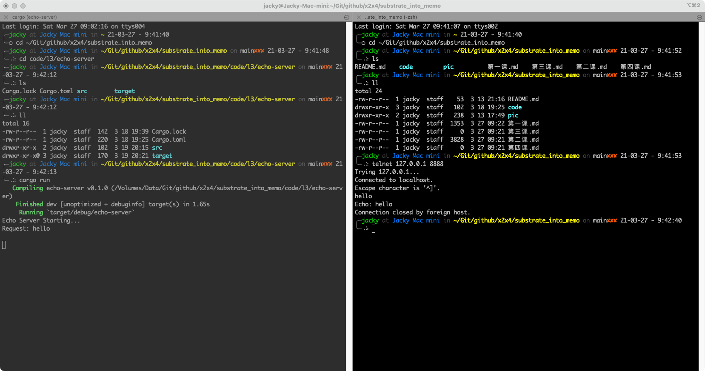

# 第三课

Rust 入门

# 作业

使用Rust std标准库的功能实现一个tcp server， 可参考网上代码自行修改，最终需要各位上传代码和运行结果的截图

## 要求

- 能正常运行
- 对tcp client（比如可用telnet等）发过来的信息，打印，并做echo返回
- 对代码每一句做注解
- 做一次标准的错误处理（模式匹配）

## 通过本次作业，做到

- 理解Rust中的基本结构用法
- 理解Rust中的基本控制流程用法
- 理解基本的模式匹配
- 理解错误处理的基本模式
- 了解标准库中的一些功能

# 作业解答

[源码地址](code/l3/echo-server/src/main.rs)

