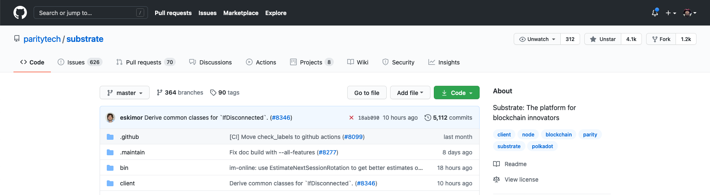
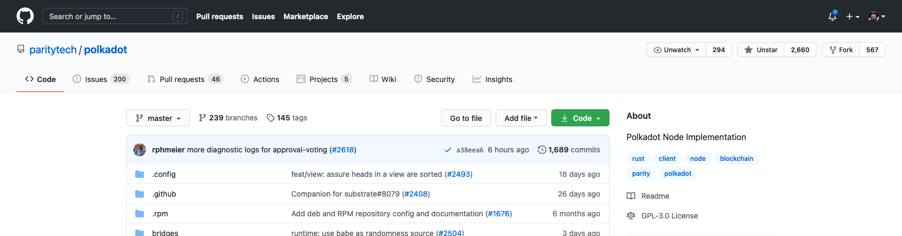
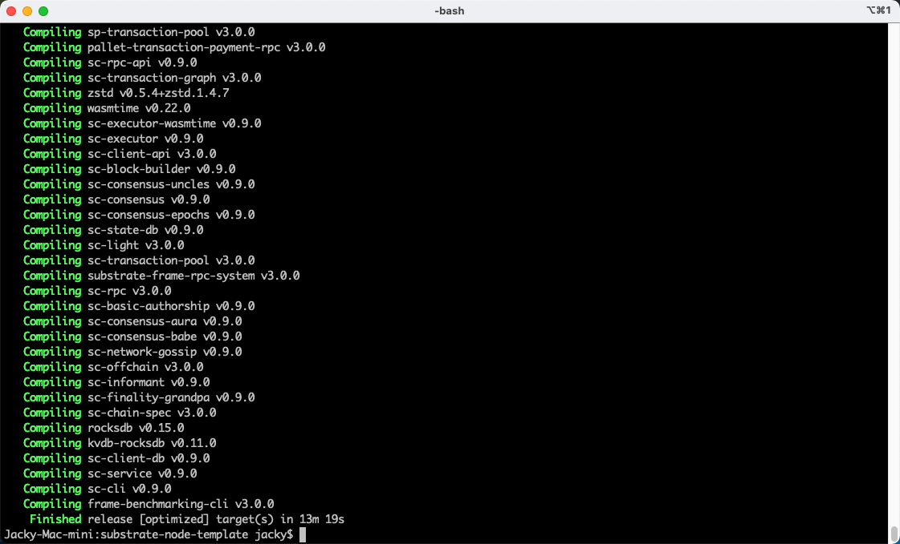
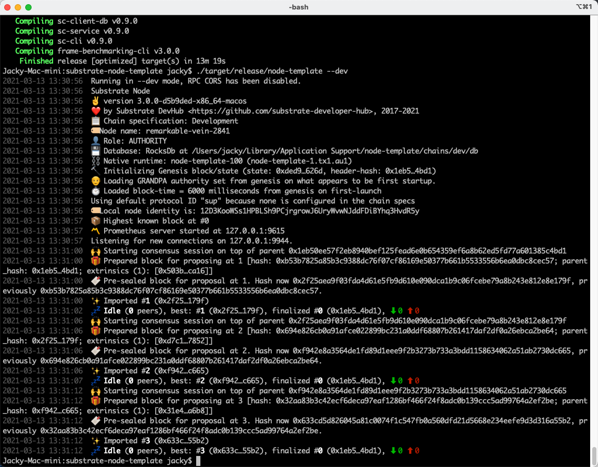

# 第二课

波卡已经有的模块，需要关注

Substrate Runtime 要关注

一键链上升级的实现，runtime分为2部分，一个是链上的wasm runtime，一个是客户端的native runtime

启动逻辑，如果wasm runtime == native runtime；则启动native runtime，否则启动wasm runtime   

链上升级，sudo 模块超级权限直接升级，强制的

off-chain workers！！

node-template介绍

decl_storage! {} 存储

decl_event! {} 事件

decl_error! {} 错误

decl_module! {} 用户可以调用的模块

impl<T: Trait> Module<T> {}  用户不可调用，给当前模块的工具方法，或者给其他模块调用的方法

# 碰到的问题

1. `Rust WASM toolchain not installed, please install it!`
    ```
    error: failed to run custom build command for `node-template-runtime v2.0.0 (/Volumes/Data/Git/github/x2x4/substrate-node-template/runtime)`

     Caused by:
      process didn't exit successfully: `/Volumes/Data/Git/github/x2x4/substrate-node-template/target/release/build/node-template-runtime-6850e655166a11e5/build-script-build` (exit code: 1)
      --- stderr
         Compiling wasm-build-runner-impl v1.0.0 (/Volumes/Data/Git/github/x2x4/substrate-node-template/target/release/wbuild-runner/node-template-runtime14351109106795501377)
          Finished release [optimized] target(s) in 0.37s
           Running `/Volumes/Data/Git/github/x2x4/substrate-node-template/target/release/wbuild-runner/node-template-runtime14351109106795501377/target/x86_64-apple-darwin/release/wasm-build-runner-impl`
      Rust WASM toolchain not installed, please install it!
    
      Further error information:
      ------------------------------------------------------------
         Compiling wasm-test v1.0.0 (/var/folders/y_/sb69wm8d4q9gmlm90pg7qtg00000gp/T/.tmpKpYvHd)
      error[E0463]: can't find crate for `std`
        |
        = note: the `wasm32-unknown-unknown` target may not be installed
    
      error: aborting due to previous error
    
      For more information about this error, try `rustc --explain E0463`.
      error: could not compile `wasm-test`
    
      To learn more, run the command again with --verbose.
      ------------------------------------------------------------

    warning: build failed, waiting for other jobs to finish...
    error: build failed
    ```
    
    解决： 系统内有多个toolchain

    ```
    $ rustup toolchain list
    nightly-2020-10-06-x86_64-apple-darwin (default)
    nightly-x86_64-apple-darwin
    ```

    2.0.0的script的init.sh中的`rustup target add wasm32-unknown-unknown --toolchain nightly`只是为nightly添加了wasm，并没有为nightly-2020-10-06添加

    最终解决

    ```
    $ rustup target add wasm32-unknown-unknown --toolchain nightly-2020-10-06
    info: downloading component 'rust-std' for 'wasm32-unknown-unknown'
    info: installing component 'rust-std' for 'wasm32-unknown-unknown'
    info: using up to 500.0 MiB of RAM to unpack components
    ```

# 作业

## 第一题

1. Substrate的官方文档地址是什么？

    https://substrate.dev/


2. Substrate的recipe网址是什么？

    https://substrate.dev/recipes/

3. Substrate的rust docs的网址是什么？

    https://substrate.dev/rustdocs/

4. Substrate的tutorial的网址是什么？

    https://substrate.dev/en/tutorials

5. Substrate Seminar在每周几进行？

    每周二 14:00 UTC，北京时间 周二 晚上10点

## 第二题

github的基本操作，养成良好的开源社区开发习惯，star和watch substrate和polkadot的repo，并截图





## 第三题

编译node-template并截图编译成功的界面



## 第四题

运行node-template节点并截图



