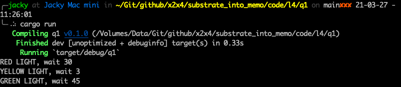
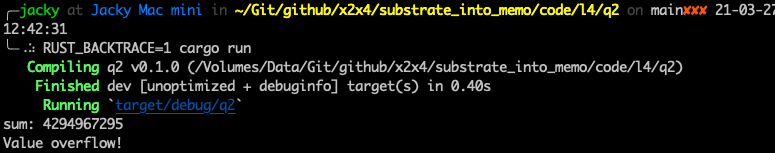
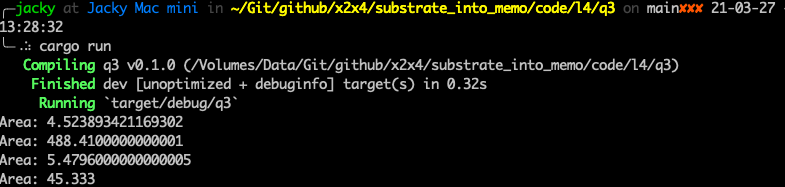

# 第四课

Rust 进阶

# 作业

1. 为枚举交通信号灯实现一个trait，trait里面包含一个返回时间的方法，不同的灯持续的时间不同，可以上传代码片段，或者代码链接；
2. 实现一个函数，为u32类型的整数集合求和，参数类型为&[u32]，返回类型为Option<u32>，溢出时返回None，可以上传代码片段，或者代码链接；
3. 实现一个打印图形面积的函数，它可以接收一个计算面积的类型作为参数，比如圆形，三角形，正方形，需要用到泛型和泛型约束，可以上传代码片段，或者代码链接；

# 作业解答

## 作业1
[源码地址](code/l4/q1/src/main.rs)

## 作业2
[源码地址](code/l4/q2/src/main.rs)

## 作业3
[源码地址](code/l4/q3/src/main.rs)

--- 临时 ---

- 单值
    - 数值：u8,i8,u32,i32,u64,i64,u128,i128
    - 大整数：U128,U256,U512
    - 布尔：bool
    - 集合：Vec<T>, BTreeMap, BTreeSet
    - 定点小数：Percent,Permill,Perbill
    - 定长哈希：H128,H256,H512
    - 其它复杂类型：Option<T>,tuple,enum,struct
    - 内置自定义类型：Moment,AccountId
- 简单映射
- 双键映射

